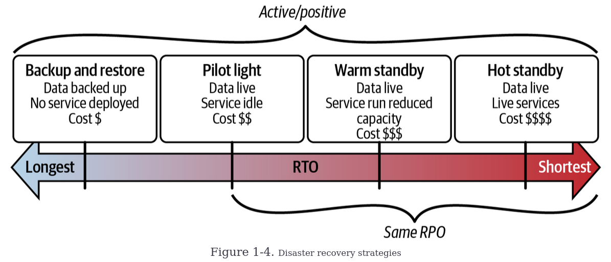

# Chapter 1 - Introduction
## Business Impact Analysis (BIA) and risk assessment
**Business Impact Analysis (BIA)** and **risk assessment** are processes used to identify and evaluate potential threats to a business,
helping define resilience goals. 

- A **BIA** focuses on identifying and prioritizing critical business processes, systems, and resources, going beyond technology to assess
how disruptions could impact operations. It examines the interconnections between people, processes, and technology, and helps develop strategies
to ensure business continuity and minimize downtime by addressing vulnerabilities.

- A **risk assessment** identifies potential threats, such as natural disasters, cyberattacks, or human error, and evaluates their likelihood and impact.
It helps businesses prioritize mitigation efforts for the most significant risks, ensuring that resources are allocated effectively to strengthen resilience.

Together, these processes allow businesses to create comprehensive continuity plans and prepare for various challenges to maintain essential functions in
the face of disruptions.

## Resilience Goals

**Resilience Goals** are critical for guiding an organization’s efforts to ensure that key systems and processes can recover quickly and remain available
during disruptions. These goals are primarily defined through two metrics: **Recovery Objectives** and **Availability Goals**.

1. **Recovery Objectives**:
   - **Recovery Time Objective (RTO)**: Defines the maximum acceptable downtime before critical systems and operations must be restored.
   - **Recovery Point Objective (RPO)**: Specifies the maximum data loss that is acceptable in the event of a disruption (e.g., how much data can
      be lost from the last backup).

   These objectives are usually expressed in time (hours, minutes, or days) and are influenced by the criticality of the system or data. For example,
   a financial platform may require a very short RTO and RPO due to the high cost of downtime or data loss, while a less critical system may have more
   lenient objectives.

3. **Availability Goals**:
   These specify the percentage of time a system must remain operational. Availability goals help set expectations for uptime and system performance,
   which vary depending on the system’s importance to the business.

**Why Resilience Goals Matter**:  
Setting resilience goals helps prioritize resources and efforts toward the most critical systems. These goals also allow businesses to measure progress
and assess their overall resilience. For instance, an e-commerce site or healthcare system may need tighter recovery and availability metrics than a simple
internal company directory.

**Bounded Recovery Time (BRT)**:  
BRT is the maximum tolerable downtime for a system or process after a disruption. Establishing a BRT ensures recovery efforts are aligned with business impact,
prioritizing resources to minimize operational and reputational damage.

## The Three Ms
The **Three Ms**—**MTBF**, **MTTD**, and **MTTR**—are key metrics used to assess system reliability and resilience, helping organizations set informed
recovery and availability goals.

1. **Mean Time Between Failures (MTBF)**:
   - **Definition**: MTBF measures the average time between failures or incidents that cause system downtime. It reflects the reliability of a system
      or component over time.
   - **Importance**: A higher MTBF value indicates a more reliable system with fewer failures and longer intervals between issues. This helps predict
      system performance and guide proactive maintenance efforts.

2. **Mean Time to Detect (MTTD)**:
   - **Definition**: MTTD measures the average time it takes to detect a failure or incident within a system or application.
   - **Importance**: A shorter MTTD means that issues are identified more quickly, which leads to faster response times and reduces the potential impact
      of the failure on system availability and user experience. Effective monitoring and alerting mechanisms are crucial for minimizing MTTD.

3. **Mean Time to Repair/Recovery (MTTR)**:
   - **Definition**: MTTR measures the average time required to repair or recover a system after a failure, restoring it to normal operations.
   - **Importance**: A shorter MTTR indicates that the system is efficiently restored after an incident, minimizing downtime and improving overall system
      resilience. Streamlined recovery procedures and automation play a key role in reducing MTTR.

To build a resilient system, it’s essential to establish **recovery objectives** and **BRT** goals that align
with both **technical feasibility** and **business needs**. Metrics like **MTBF**, **MTTD**,
and **MTTR** play a key role in shaping these goals.

1. **MTBF and MTTD** help inform **recovery objectives**:
   - **MTBF** provides insights into the average time between failures, indicating the reliability of your system. A better understanding of MTBF helps you              estimate how often failures might occur, allowing you to set recovery objectives that align with typical downtime intervals.
   - **MTTD** tells you how long it typically takes to detect an issue. By understanding detection times, you can establish realistic recovery objectives based on       how long it generally takes to identify and respond to failures.

2. **MTTR influences BRT**:
   - **MTTR** measures the average time to repair or recover from a failure. Knowing your historical MTTR helps set achievable **BRT goals**, as faster recovery         times (lower MTTR) allow for more aggressive BRT targets, ensuring the system can restore functionality quickly and minimize business impact.

### Steps to Set Resilience Goals:
1. **Establish Baselines**:
   - Analyze your historical data to determine your baseline MTBF, MTTD, and MTTR values. These metrics give you a realistic view of past performance and help           identify areas for improvement.

2. **Set Improvement Goals**:
   - Based on your baselines, aim to reduce failures (improve MTBF) and improve recovery times (reduce MTTR). Focus on improving detection times (MTTD) for quicker      response and mitigation.

3. **Align with Business Needs**:
   - Consider the financial impact, customer experience, and other business factors that downtime may affect. Systems in critical areas (e.g., financial                 transactions, healthcare) may need stricter recovery objectives and BRTs than noncritical systems.

4. **Monitor and Adjust**:
   - Continuously track MTBF, MTTD, and MTTR to assess the effectiveness of your resilience strategies. Use this data to refine your recovery objectives and BRT         goals, ensuring they remain aligned with business requirements.

## AWS Resilience Analysis Framework

The AWS Resilience Analysis Framework (RAF) is a methodology for assessing and improving the resilience of workloads. It helps identify potential failure points in applications and provides strategies to mitigate or prevent disruptions. RAF defines five key resilience properties for highly available systems: redundancy, sufficient capacity, timely output, correct output, and fault isolation. Violations of these properties can lead to system unavailability.

RAF outlines five common failure categories that can impact these properties:
1. **Single Point of Failure (SPOF)** – Lack of redundancy causes system disruption.
2. **Excessive Load** – Overuse of resources leads to capacity issues and throttling.
3. **Excessive Latency** – Delays in processing or network traffic violate timely output.
4. **Misconfiguration and Bugs** – Errors in system configuration or software lead to incorrect outputs.
5. **Shared Fate** – Faults spread across fault isolation boundaries, affecting other parts of the system or users.

## AWS Well-Architected Framework

The AWS Well-Architected Framework provides a set of principles and best practices for designing, building, testing, and operating secure, efficient, and resilient workloads on AWS. It is structured around six key pillars: **Operational Excellence**, **Security**, **Reliability**, **Performance Efficiency**, **Cost Optimization**, and **Sustainability**. These pillars guide architects, developers, and engineers in creating cloud infrastructures.

Focusing on **Reliability** and **Operational Excellence** for resilience:

- The **Reliability** pillar ensures workloads perform consistently, even in challenging conditions. It emphasizes building fault-tolerant systems, recovery strategies, and performance optimization to maintain availability and minimize downtime.

- The **Operational Excellence** pillar focuses on optimizing operational processes to manage and maintain workloads efficiently. It stresses automation, continuous process improvement, incident management, and resource optimization to enhance the overall reliability and efficiency of AWS workloads.

## High Availability (HA)

HA focuses on minimizing downtime and ensuring systems remain operational, even during hardware or software failures. Key aspects of HA include:

1. **Redundancy**: Systems use multiple redundant components (e.g., servers, storage, applications, data replication) so if one component fails, another can take over, ensuring continuous service.

2. **Self-Healing**: HA systems often have automated recovery mechanisms, such as automatically restarting failed applications, reducing manual intervention and improving recovery times.

3. **Scalability and Efficiency**: HA systems are typically horizontally scalable, allowing them to handle increased traffic or workload demands efficiently. This flexibility ensures high availability under heavy load while optimizing resource use and costs.

4. **Management and Monitoring**: Centralized management tools help administrators monitor system health, configure components, and conduct maintenance. Advanced monitoring and real-time alerts help proactively identify and resolve issues before they lead to outages, minimizing downtime.

## Disaster Recovery

Disaster Recovery is a critical component of business continuity, focusing on recovering from catastrophic events that cause system outages. It includes both technical recovery measures and the processes and human resources needed to restore operations effectively.

Key steps in disaster recovery planning include:
1. **Identifying critical business functions** and prioritizing recovery objectives.
2. **Establishing Recovery Time Objectives (RTOs)** and **Recovery Point Objectives (RPOs)** to define acceptable downtime and data loss.
3. **Designing a comprehensive recovery plan** that outlines specific actions to take during and after a disaster.

In AWS, disaster recovery differs from traditional on-premise approaches. The AWS Global Infrastructure helps mitigate concerns related to spare hardware, natural disasters, fire risks, and power outages. Failing servers can be easily replaced, and the distribution of availability zones within a region can help minimize the impact of power interruptions, fires, and natural disasters. For AWS disaster recovery, attention is focused in possible failure modes of the application, such as data corruption, regional service impairments, and problematic deployments.  

## Disaster Recovery Strategies

Disaster Recovery Strategies help ensure business continuity by addressing how to recover systems and data in the event of a disaster. There are several strategies, each suited to different business needs, resource constraints, and recovery objectives.

1. **Backup and Restore**:
   - Involves regularly backing up critical data and system configurations to a secure location.
   - Cost-effective and ideal for scenarios where system outages aren't critical.
   - Recovery time can be longer, depending on the complexity of restoring the entire environment.
   - It’s important to distinguish this strategy from simple data backup; because it also includes the ability to **restore data, configurations, networking, and       compute resources.**

2. **Pilot Light**:
   - Maintains a minimal, preconfigured infrastructure in a recovery environment, which can be scaled up during a disaster.
   - Suitable for scenarios where recovery time objectives allow for scaling up resources using automation tools.
   - Ideal for less critical applications or when budget is a concern.

3. **Warm Standby**:
   - Keeps a replica of the production environment, synchronized with the primary system but not actively processing transactions.
   - Some resources are running, allowing for quicker scaling during a disaster compared to a pilot light.
   - Suitable when downtime is costly but maintaining a fully operational environment (hot standby) is not justified. It balances cost with faster recovery times.

4. **Hot Standby**:
   - Maintains a fully operational, synchronized copy of the production environment, ready to take over operations with minimal downtime in a disaster.
   - Best for mission-critical applications where even brief downtime could have significant consequences.
   - Expensive, as it requires a fully operational replica of the production environment.

## Service Quotas

Service Quotas are predefined limits on the usage of resources or operations within an account or region. Effective management of these quotas is essential for maintaining stability, reliability, and cost-effectiveness of cloud services. Exceeding service quotas can result in resource exhaustion, service degradation, or outages, so staying within these limits is key to ensuring application availability and performance.

### Key Strategies for Managing Service Quotas:

1. **Understand Service Quotas**:
   - AWS sets different quotas for each service, dictating the maximum number of resources or operations allowed. Familiarizing yourself with these quotas helps        make informed decisions about resource usage.

2. **Monitor and Manage Quotas**:
   - Use tools like **AWS CloudTrail** and **Amazon CloudWatch** to monitor resource usage. Set up **alarms** to notify you when usage approaches predefined thresholds.
   - Integrate quota increase requests into your workflow using the **AWS Service Quotas API** to automate the process of requesting additional resources when          limits are reached.

3. **Optimize Resource Allocation**:
   - Prioritize critical workloads and applications to ensure resources are allocated effectively. Use **AWS resource tagging** to categorize and track resource        usage based on business priorities.
   - Regularly review and optimize resource usage by analyzing patterns, identifying inefficiencies, and implementing measures to improve utilization. This helps       reduce costs and ensures resources are being used efficiently.

## Change Management

Effective change management is crucial for maintaining smooth operations and resilience. It involves establishing a formal process for **requesting, evaluating, approving, implementing, and documenting changes.** Clear roles and responsibilities for all stakeholders help reduce risks, prevent disruptions, and ensure stability. Communication and collaboration among teams are key to success, encouraging feedback and knowledge sharing.

**A rollback plan** should be in place for unforeseen issues, and mitigation strategies should be considered when rollback isn't possible. Risk assessments should evaluate downtime, data loss, and security implications. Comprehensive testing, documentation of changes, and detailed tracking of risks and impacts are essential for long-term success.

Automation tools can streamline change management, while manual processes should include safeguards like two-person verification to reduce errors. Monitoring key performance indicators (KPIs) helps track the impact of changes, and ongoing evaluation ensures that change management practices evolve with lessons learned and best practices.

## Failure Management

Failure management is essential in modern technology environments, as failures are inevitable despite careful planning. A well-defined failure management process helps mitigate risks, minimize downtime, and ensure quick recovery. It is vital for meeting regulatory requirements and minimizing financial losses due to service interruptions.

Key elements of an effective failure management process include setting up monitoring thresholds and alarms to detect issues like performance degradation or service disruptions. Automated alerts notify relevant teams to take corrective actions or trigger automated remediation before problems escalate.

**Response playbooks**, developed collaboratively with cross-functional teams, outline predefined actions, escalation paths, and communication protocols for handling different incidents. Automation tools and scripts are integrated into incident response systems to automate remediation, such as restarting services or triggering failover mechanisms. Infrastructure as code (IaC) and orchestration tools help automate complex workflows and coordinate responses across systems.

Continuous improvement is crucial, involving regular post-incident reviews and root cause analysis (RCA) to identify lessons learned and optimize response strategies. Periodic drills and simulations test and refine automated systems, enhancing their effectiveness over time. The goal is to continuously improve playbooks, automation scripts, and workflows to ensure efficient and accurate failure management.

## Observability

Observability is essential for gaining real-time insights into system performance, health, and behavior, enabling proactive issue identification before disruptions occur. It relies on three core pillars: **logs, metrics, and traces**, each providing unique insights to create a comprehensive understanding of system health and performance.

- **Logs** are detailed records of system events, helping to identify root causes, troubleshoot issues, and analyze user behavior.
- **Metrics** are numerical measurements that track system performance over time, revealing trends, bottlenecks, and resource usage to ensure efficient scaling.
- **Traces** track the journey of user requests across multiple components, highlighting performance issues and bottlenecks in distributed systems.

Together, these pillars provide a holistic view of the system. Logs offer context for metrics, metrics highlight trends visible in logs, and traces provide detailed insights into request flows. This synergy helps diagnose problems effectively, optimize performance, and enhance user experience.

Observability also supports postmortem analysis after failures by providing data to identify root causes, patterns, and areas for improvement. This fosters continuous learning, resilience, and system refinement.

Ultimately, observability acts as an early warning system, helping teams to proactively manage issues, minimize downtime, and ensure continuous availability and performance of workloads.

## Continuous Testing and Chaos Engineering

Continuous Testing and Chaos Engineering are essential practices for building resilient systems by ensuring they perform well under both normal and stressful conditions.

- **Continuous Testing** involves testing all components of your system—application code, infrastructure as code (IaC), change management, failure recovery processes, and observability mechanisms. Traditional testing (unit, integration, and regression tests) helps catch bugs early in development, but it may not replicate real-world complexities and failures.
  
- **Chaos Engineering** takes a proactive approach by intentionally introducing controlled failures into your system to uncover vulnerabilities before they become critical. It goes beyond normal testing by pushing systems to their limits, simulating real-world disruptions to understand how they behave under stress. Key best practices in chaos engineering include:
  - **Start small** and gradually increase complexity.
  - **Define hypotheses and metrics** for each experiment.
  - **Control the blast radius** to prevent disruptions to production environments.
  - **Automate experiments** for consistency and repeatability.
  - **Continuously learn** from each experiment to improve system resilience.

Chaos engineering helps shift the focus from reactive to proactive system resilience, allowing teams to address potential failures early, strengthen infrastructure, and ensure systems can withstand real-world stressors.

**AWS Fault Injection Service (FIS)** is a powerful tool for implementing chaos engineering on AWS. It enables controlled disruptions such as EC2 terminations or network latency to test how applications and infrastructure respond to failures. Benefits of using AWS FIS include:
  - **Simplified chaos experiments** with no need to build custom tools.
  - **Safe fault injection** in a controlled environment without impacting production.
  - **Comprehensive insights** into test results to identify vulnerabilities.
  - **Automated chaos testing** integrated into CI/CD pipelines for continuous improvement.
  - **Scalable experiments** across multiple AWS accounts and regions.

By using AWS FIS, organizations can more easily incorporate chaos engineering into their workflows, enhancing resilience, reducing downtime, and improving customer experience by identifying and addressing weaknesses before they impact operations.

## CI/CD and Automation

CI/CD and Automation are key practices for building resilient, reliable systems. **Continuous Integration (CI)** and **Continuous Delivery (CD)** automate the integration, testing, and deployment of code, enabling faster iterations and continuous improvement. This approach reduces human error, speeds up feature delivery, and allows rapid detection and resolution of issues, minimizing vulnerabilities and potential outages.

CI/CD offers several benefits:
- **Consistency**: Standardized, repeatable processes eliminate errors from manual deployments, reducing configuration drift and unexpected failures.
- **Speed**: Automating testing and deployment accelerates the delivery of new features and fixes, ensuring that systems remain stable and adaptable.
- **Collaboration**: CI/CD fosters a culture of collaboration and continuous value delivery while maintaining system reliability.

To maximize the effectiveness of CI/CD, consider these best practices:
1. **Frequent Code Commits**: Developers should commit changes regularly (even multiple times a day) to avoid merge conflicts and make it easier to isolate and fix issues.
2. **Comprehensive Automated Testing**: Implement automated tests at all levels—unit, integration, and end-to-end—to ensure code quality and catch bugs early.
3. **Infrastructure as Code**: Use immutable infrastructure patterns, creating new instances for each deployment rather than modifying existing ones, to ensure consistency and avoid configuration drift.
4. **Observability**: Integrate monitoring and observability tools to detect issues in real-time, enabling quick responses to maintain system health.
5. **Automated Deployment**: Automate the deployment process to reduce human error and ensure consistent application of configurations across environments.
6. **Rollback Strategies**: Have defined procedures to quickly revert to a stable version in case of deployment failure.
7. **Security Testing**: Integrate security checks into the CI/CD pipeline to identify and address vulnerabilities early, reducing the risk of breaches.

By adopting these best practices, CI/CD helps build systems that are not only resilient to disruptions but also capable of adapting to evolving requirements and delivering a consistent user experience.

## Continuous Resilience

Continuous Resilience is a proactive approach to building organizational systems, processes, and capabilities that can withstand and recover from disruptions. Unlike traditional, reactive resilience strategies, continuous resilience focuses on **ongoing analysis, refinement, and optimization** to ensure systems remain effective, efficient, and aligned with changing business needs.

Key aspects of continuous resilience include:

- **Proactive, Iterative Approach**: Continuously improving applications and processes to meet resilience goals and adapt to evolving challenges.
- **Cultural Shift**: Moving from reactive to proactive resilience management requires buy-in from leadership and a mindset shift throughout the organization.
- **Ongoing Commitment**: Resilience is a journey, not a one-time effort. It involves continuous learning, adaptation, and improvement to stay resilient in the face of change.

By fostering a culture of continuous resilience, organizations can minimize downtime, ensure business continuity, and improve their ability to handle disruptions, ultimately contributing to long-term business success.
