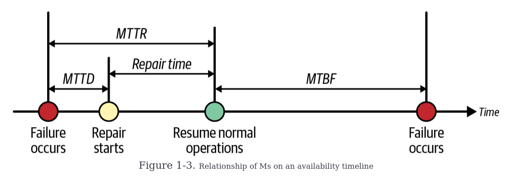

# Chapter 1 - Introduction
## Business Impact Analysis (BIA) and risk assessment
**Business Impact Analysis (BIA)** and **risk assessment** are processes used to identify and evaluate potential threats to a business,
helping define resilience goals. 

- A **BIA** focuses on identifying and prioritizing critical business processes, systems, and resources, going beyond technology to assess
how disruptions could impact operations. It examines the interconnections between people, processes, and technology, and helps develop strategies
to ensure business continuity and minimize downtime by addressing vulnerabilities.

- A **risk assessment** identifies potential threats, such as natural disasters, cyberattacks, or human error, and evaluates their likelihood and impact.
It helps businesses prioritize mitigation efforts for the most significant risks, ensuring that resources are allocated effectively to strengthen resilience.

Together, these processes allow businesses to create comprehensive continuity plans and prepare for various challenges to maintain essential functions in
the face of disruptions.

## Resilience Goals

**Resilience Goals** are critical for guiding an organization’s efforts to ensure that key systems and processes can recover quickly and remain available
during disruptions. These goals are primarily defined through two metrics: **Recovery Objectives** and **Availability Goals**.

1. **Recovery Objectives**:
   - **Recovery Time Objective (RTO)**: Defines the maximum acceptable downtime before critical systems and operations must be restored.
   - **Recovery Point Objective (RPO)**: Specifies the maximum data loss that is acceptable in the event of a disruption (e.g., how much data can
      be lost from the last backup).

   These objectives are usually expressed in time (hours, minutes, or days) and are influenced by the criticality of the system or data. For example,
   a financial platform may require a very short RTO and RPO due to the high cost of downtime or data loss, while a less critical system may have more
   lenient objectives.

3. **Availability Goals**:
   These specify the percentage of time a system must remain operational. Availability goals help set expectations for uptime and system performance,
   which vary depending on the system’s importance to the business.

**Why Resilience Goals Matter**:  
Setting resilience goals helps prioritize resources and efforts toward the most critical systems. These goals also allow businesses to measure progress
and assess their overall resilience. For instance, an e-commerce site or healthcare system may need tighter recovery and availability metrics than a simple
internal company directory.

**Bounded Recovery Time (BRT)**:  
BRT is the maximum tolerable downtime for a system or process after a disruption. Establishing a BRT ensures recovery efforts are aligned with business impact,
prioritizing resources to minimize operational and reputational damage.

## The Three Ms
The **Three Ms**—**MTBF**, **MTTD**, and **MTTR**—are key metrics used to assess system reliability and resilience, helping organizations set informed
recovery and availability goals.

1. **Mean Time Between Failures (MTBF)**:
   - **Definition**: MTBF measures the average time between failures or incidents that cause system downtime. It reflects the reliability of a system
      or component over time.
   - **Importance**: A higher MTBF value indicates a more reliable system with fewer failures and longer intervals between issues. This helps predict
      system performance and guide proactive maintenance efforts.

2. **Mean Time to Detect (MTTD)**:
   - **Definition**: MTTD measures the average time it takes to detect a failure or incident within a system or application.
   - **Importance**: A shorter MTTD means that issues are identified more quickly, which leads to faster response times and reduces the potential impact
      of the failure on system availability and user experience. Effective monitoring and alerting mechanisms are crucial for minimizing MTTD.

3. **Mean Time to Repair/Recovery (MTTR)**:
   - **Definition**: MTTR measures the average time required to repair or recover a system after a failure, restoring it to normal operations.
   - **Importance**: A shorter MTTR indicates that the system is efficiently restored after an incident, minimizing downtime and improving overall system
      resilience. Streamlined recovery procedures and automation play a key role in reducing MTTR.

To build a resilient system, it’s essential to establish **recovery objectives** and **BRT** goals that align
with both **technical feasibility** and **business needs**. Metrics like **MTBF**, **MTTD**,
and **MTTR** play a key role in shaping these goals.

1. **MTBF and MTTD** help inform **recovery objectives**:
   - **MTBF** provides insights into the average time between failures, indicating the reliability of your system. A better understanding of MTBF helps you              estimate how often failures might occur, allowing you to set recovery objectives that align with typical downtime intervals.
   - **MTTD** tells you how long it typically takes to detect an issue. By understanding detection times, you can establish realistic recovery objectives based on       how long it generally takes to identify and respond to failures.

2. **MTTR influences BRT**:
   - **MTTR** measures the average time to repair or recover from a failure. Knowing your historical MTTR helps set achievable **BRT goals**, as faster recovery         times (lower MTTR) allow for more aggressive BRT targets, ensuring the system can restore functionality quickly and minimize business impact.

### Steps to Set Resilience Goals:
1. **Establish Baselines**:
   - Analyze your historical data to determine your baseline MTBF, MTTD, and MTTR values. These metrics give you a realistic view of past performance and help           identify areas for improvement.

2. **Set Improvement Goals**:
   - Based on your baselines, aim to reduce failures (improve MTBF) and improve recovery times (reduce MTTR). Focus on improving detection times (MTTD) for quicker      response and mitigation.

3. **Align with Business Needs**:
   - Consider the financial impact, customer experience, and other business factors that downtime may affect. Systems in critical areas (e.g., financial                 transactions, healthcare) may need stricter recovery objectives and BRTs than noncritical systems.

4. **Monitor and Adjust**:
   - Continuously track MTBF, MTTD, and MTTR to assess the effectiveness of your resilience strategies. Use this data to refine your recovery objectives and BRT         goals, ensuring they remain aligned with business requirements.

